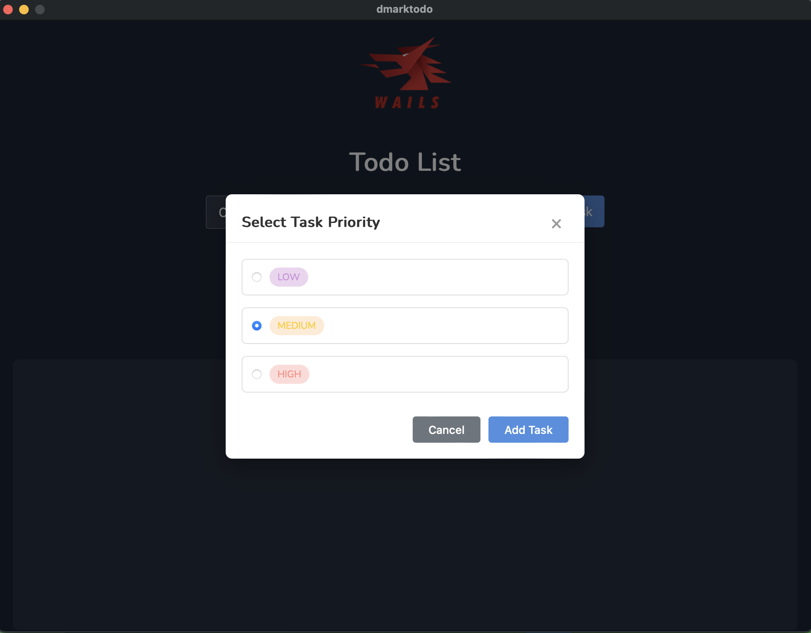

# DMarkTodo

A todo application built with Wails (Go + Svelte) and PostgreSQL.

## Screenshots

<!-- Screenshot placeholder-->


<!-- Screenshot placeholder -->


<!-- Screenshot placeholder -->


<!-- Screenshot placeholder -->


<!-- Screenshot placeholder] -->


<!-- Screenshot placeholder] -->


<!-- Screenshot placeholder] -->


<!-- Screenshot placeholder] -->


<!-- Screenshot placeholder] -->


## Prerequisites

Before compiling and running the project, ensure you have the following installed:

- [Go](https://golang.org/dl/) (version 1.21 or later)
- [Node.js](https://nodejs.org/) (version 18 or later)
- [Docker](https://www.docker.com/get-started) and Docker Compose
- [Wails CLI](https://wails.io/docs/gettingstarted/installation)

## Compilation and Setup

### 1. Start PostgreSQL Database

First, start the PostgreSQL database using Docker Compose:

```bash
docker compose up -d
```

This will start the PostgreSQL container with the required database configuration.

### 2. Build the Application

Build the application using Wails:

```bash
wails build
```

This creates a production-ready executable in the `build/bin/` directory.

### 3. Run the Application

After building, run the application from the terminal:

```bash
./build/bin/dmarktodo
```

## Development

### Live Development Mode

To run in live development mode with hot reload:

```bash
wails dev
```

This will run a Vite development server that provides very fast hot reload of your frontend changes. If you want to develop in a browser and have access to your Go methods, there is also a dev server that runs on http://localhost:34115. Connect to this in your browser, and you can call your Go code from devtools.

### Project Structure

```
├── backend/          # Go backend code
├── frontend/         # Svelte frontend code
├── build/           # Compiled application
├── docker-compose.yml # PostgreSQL database setup
└── wails.json       # Wails configuration
```
